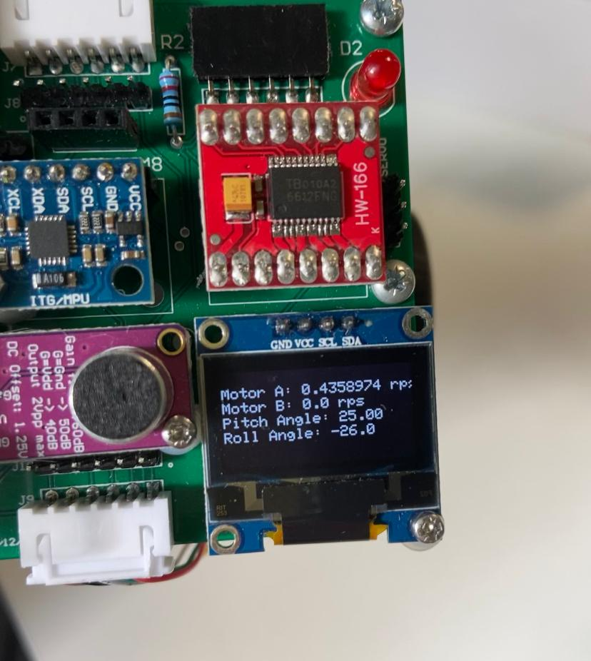

# Challenge 2 - Control speed and direction of motors using IMU

The following code was used

```python
####
## Setup
####

# Imports
import pyb
from pyb import Pin, Timer, ExtInt
from array import array			# need this for memory allocation to buffers
import micropython
from oled_938 import OLED_938	# Use OLED display driver
from mpu6050 import MPU6050

# OLED screen setup

i2c = pyb.I2C(2, pyb.I2C.MASTER)
devid = i2c.scan()
oled = OLED_938(
    pinout = {
        "sda": "Y10",
        "scl": "Y9",
        "res": "Y8"
    },
    height = 64,
    external_vcc = False,
    i2c_devid = i2c.scan()[0]
)
oled.poweron()
oled.init_display()

# Initialise variables
speed = 0

A_speed = 0             # latest speed of motor A  
A_count = 0             # postiive transition count

B_speed = 0             # latest speed of motor B  
B_count = 0             # postiive transition count

## IMU Setup

# Initialise IMU (connected to X9 and X10)
imu = MPU6050(1, False)

def read_imu(dt):

    # Setup global variables
    global g_pitch
    global g_roll

    # Change time constant (larger = longer)
    alpha = 0.7

    # Read pitch and roll
    pitch = int(imu.pitch())
    roll = int(imu.roll())

    # Set filtered pitch and roll to global variables
    g_pitch = alpha * (pitch + imu.get_gy() * dt * 0.001) + (1 - alpha) * pitch
    g_roll = alpha * (roll + imu.get_gx() * dt * 0.001) + (1 - alpha) * roll

## Motor control setup

# define potentiometer pin
pot = pyb.ADC(Pin("X11"))

# define pins to control motor
A1 = Pin("X3", Pin.OUT_PP)
A2 = Pin("X4", Pin.OUT_PP)
PWMA = Pin("X1")

B1 = Pin("X7", Pin.OUT_PP)
B2 = Pin("X8", Pin.OUT_PP)
PWMB = Pin("X2")

# configure timer 2 to produce 1kHz clock for PWM control
tim = Timer(2, freq = 1000)
motorA = tim.channel(1, Timer.PWM, pin = PWMA)
motorB = tim.channel(2, Timer.PWM, pin = PWMB)

# motor control functions
def A_forward(value):
    A1.low()
    A2.high()
    motorA.pulse_width_percent(value)   

def B_forward(value):
    B1.high()
    B2.low()
    motorB.pulse_width_percent(value)  

def A_back(value):
    A1.high()
    A2.low()
    motorA.pulse_width_percent(value)

def B_back(value):
    B1.low()
    B2.high()
    motorB.pulse_width_percent(value)

def A_stop():
    A1.low()
    A2.low()

def B_stop():
    B1.low()
    B2.low()

## Interupt Setup

# motor A sensor ISR - just count transitions
def isr_motorA(dummy):	
    global A_count
    A_count += 1

# motor B sensor ISR - just count transitions
def isr_motorB(dummy):	
    global B_count
    B_count += 1
		
# timer interrupt at 100ms intervals
def isr_speed_timer(dummy):
    global A_count
    global A_speed
    global B_count
    global B_speed

    # remember count value
    A_speed = A_count
    B_speed = B_count

    # reset the count
    A_count = 0
    B_count = 0
	
# Create external interrupts for Hall Effect Sensors
micropython.alloc_emergency_exception_buf(100)

motorA_int = ExtInt ('Y4', ExtInt.IRQ_RISING, Pin.PULL_NONE,isr_motorA)
motorB_int = ExtInt ('Y6', ExtInt.IRQ_RISING, Pin.PULL_NONE,isr_motorB)

# Create timer interrupts at 100 msec intervals
speed_timer = pyb.Timer(4, freq = 10)
speed_timer.callback(isr_speed_timer)

####
## Main program loop
####

# Start timer
tic = pyb.millis()

# Infinite loop
while True:

    # Read IMU
    toc = pyb.millis()
    read_imu(toc - tic)

    # Write to motor
    if g_pitch >= 0:
        A_forward(g_pitch)
    else:
        A_back(abs(g_pitch))

    if g_roll >= 0:
        B_forward(g_roll)
    else:
        B_back(abs(g_roll))

    # Display new speed
    oled.draw_text(0, 10, f"Motor A: {A_speed/39} rps")
    oled.draw_text(0, 20, f"Motor B: {B_speed/39} rps")
    oled.draw_text(0, 30, f"Pitch Angle: {g_pitch}")
    oled.draw_text(0, 40, f"Roll Angle: {g_roll}")
    oled.display()

    # Delay
    pyb.delay(100)

    # Restart timer
    tic = pyb.millis()

```

The code functioned very well at controlling the motors from the tilt of the PyBench. The motor speeds of A and B as well as the pitch and roll angles were displayed successfully on the OLED display.

One observation was that roll angle was skewed off centre. In order to get a `0` reading for `g_roll` the PyBench had to be tilted to the left. Otherwise it worked perfectly.



Demo video is accessible at `media/demo.mp4`


