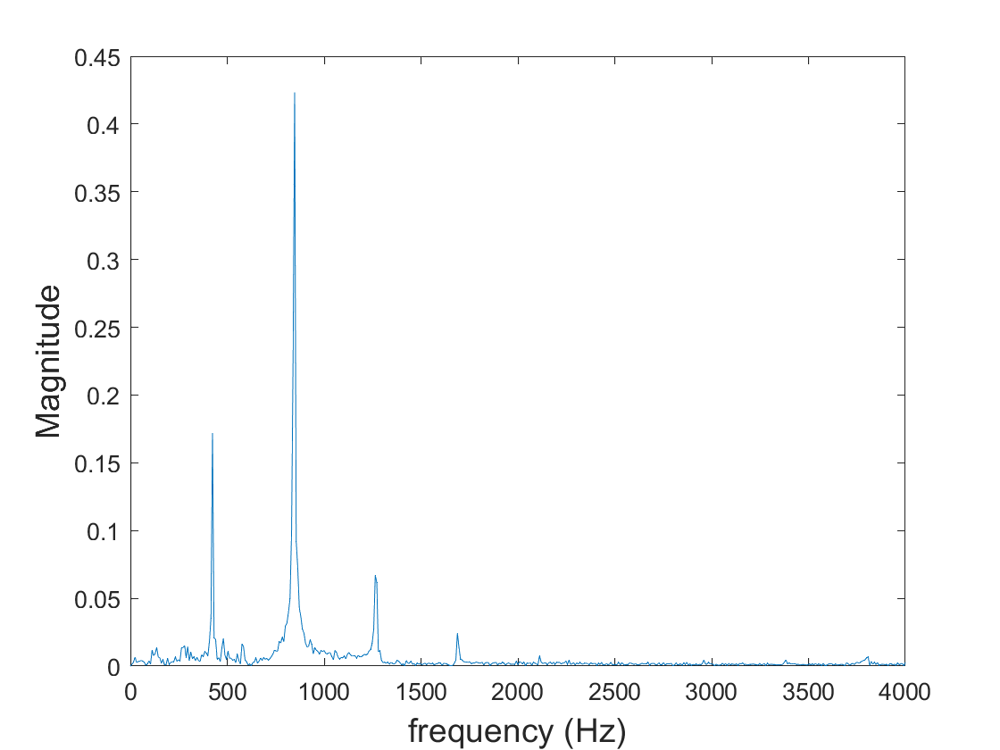

# Lab 2 Log

## Task 1 - Connecting the PyBench board to your PC or Macbook running Matlab

The PyBench was connected to my computer and was recognised as a device. The list of constituent python files was seen.


The *PyBench Self-Test* was activated and all tests (apart from the motor test) were performed. They all passed and functioned as expected.

PyBench was setup with Matlab and I was able to access the *PyBench* class library properly.

```matlab
>> ports = serialportlist

ports = 

  1×2 string array

    "COM3"    "COM5"

>> pb = PyBench(ports(end))

pb = 

  PyBench with properties:

    BUFFERSIZE: 20000
      sig_freq: 10
          dc_v: 1.6500
         max_v: 3.3000
         min_v: 0
    duty_cycle: 50
     samp_freq: 100

>> 
```

## Task 2 - Using PyBench to generate signals via Matlab and explore their spectra

### Scope

The code given was used to generate a sine signal on the PyBench. This initially did not work, giving a strange signal on the scope but I discovered that the main ground pin on the PyBench was broken. When an alternative ground pin was used, the scope displayed the expected waveform.

```matlab
% Lab 2 - Task 2 - Signal generation and capture with PyBench
%
clear all
ports = serialportlist;     % find all serial ports
pb = PyBench(ports(end));   % create a PyBench object with last port

% Set parameters

f = 440;                    % signal frequency
fs = 8000;                  % sampling frequency
pb = pb.set_sig_freq(f);
pb = pb.set_samp_freq(fs);
pb = pb.set_max_v(3.0);     % set maximum output voltage
pb = pb.set_min_v(0.5);     % set minimum output voltage
pb = pb.set_duty_cycle(50);

% Generate a signal

pb.sine()
```


By changing `pb.sine()` to `pb.square()` and `pb.triangle()` I was able to generate square and triangle waveforms.


### Sampling

The code was amended was added the following lines to the end of the existing code.

```matlab
% Capture N samples

N = 1000;
samples = pb.get_block(N);
data = samples - mean(samples);

% plot data

figure(1);
plot(data(1:200),"o");
hold on
plot(data(1:200));
xlabel("Sample no");
ylabel("Signal Voltage (V)");
title("Captured signal");
hold off

% find spectrum

figure(2);
plot_spec(data, fs);
```

This samples the signals generated by the *PyBench* were sampled by *Matlab* and plots the frequency spectrum for each.


*Sine spectrum*


*Square wave spectrum*


*Triangle wave spectrum*

The sine wave has a single consistent frequency and thus only has a single spike in its spectrum.

The square wave is a superposition of many sine waves and thus has many spikes.

The triangle wave is a superposition of of sine waves too but has a more obvious frequency compared to the square waves, which is why its first spike is more prominent in comparison to subsequent spikes. Compared to the square wave spectrum.

## Task 3 - Capture and analyse microphone signals

The following Matlab script was used to produce a time-domain and frequency-domain plot of the signal captured from the PyBoard’s microphone. 

```matlab
% Lab 2 - Task 3 - Capture and analyse microphone sound signal
%
clear all
ports = serialportlist;
pb = PyBench(ports(end));

% Set sampling frequency
fs = 8000;
pb = pb.set_samp_freq(fs);

% Capture N samples
N = 1000;
samples = pb.get_mic(N);
data = samples - mean(samples);

% plot data
figure(1);
clf
plot(data);
xlabel("Sample no")
ylabel("Signal voltage");
title("Microphone signal");

% find and plot spectrum
figure(2)
plot_spec(data, fs)
```

It was tested on our whistling as well as a 2000 Hz sound from a tuning fork app. The plots from the tuning fork app are shown below.


### Spectrum Analyser

The following code was added to make this process into a continuously updating frequency analyser.

```matlab
% repeat capture and plot spectrum
while true
    samples = pb.get_mic(N);
    data = samples - mean(samples);
    figure(2)
    clf;
    plot_spec(data,fs);
end
```

The following frequency spectrum was generated from my lab partner singing, harmonics are visible.



## Task 4 - Windowing effect on a signal

