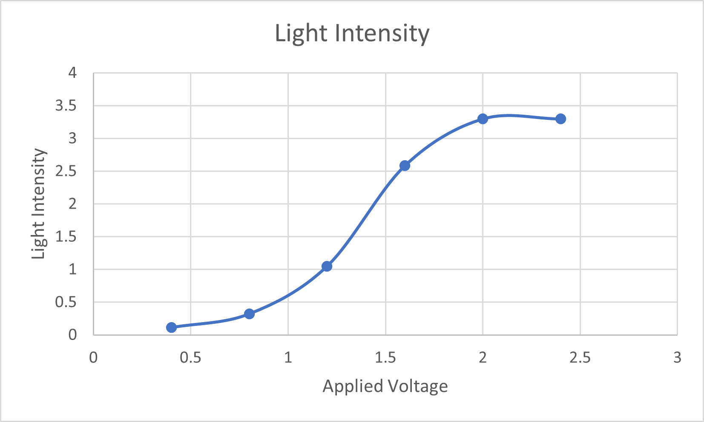
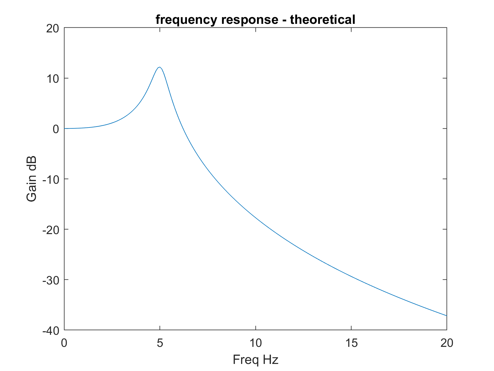
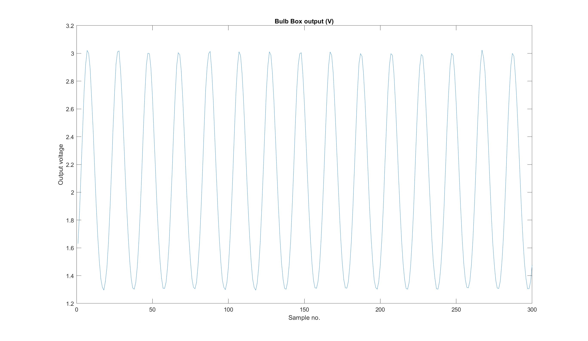
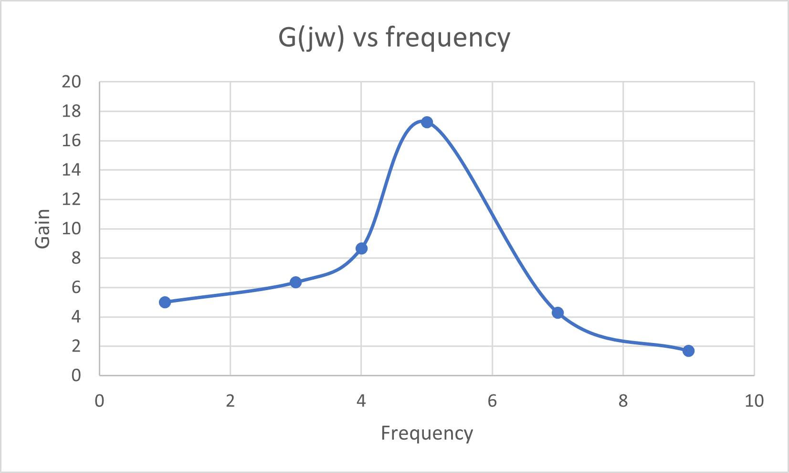
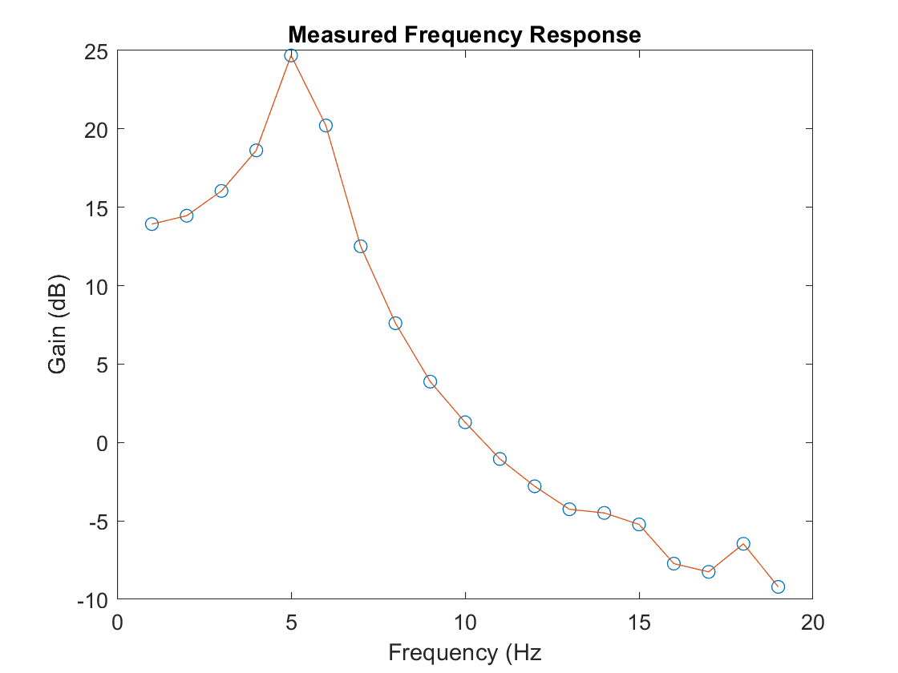
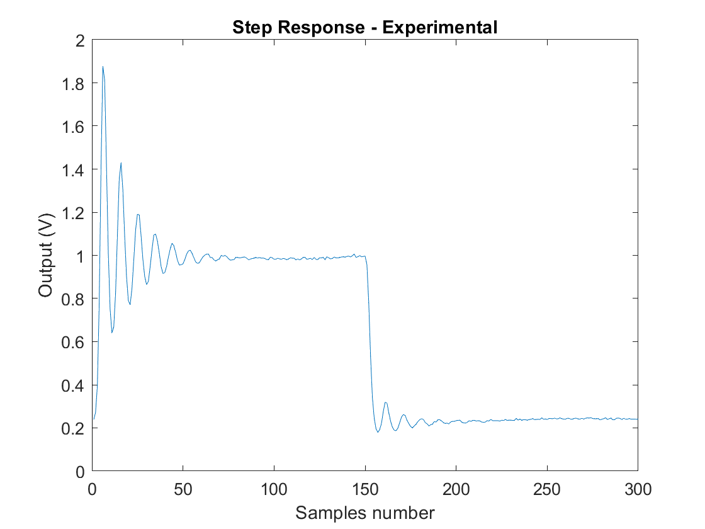

# Lab 3 Log

## Setup

The Bulb Board was setup to the PyBench as described. The potentiometer was turned until the PyBench displayed ***1.97 V*** - between *1.9* and *2.1 V*.

## Task 1 - DC Characteristic of the Bulb Board

The following code was inputted into the command window

```matlab
>> clear all
>> ports = serialportlist

ports = 

    "COM4"

>> pb = PyBench(ports(end));
>> pb.dc(1.5);
>> pause(1)
>> pb.get_one()

ans =

   2.0125
```

When the output voltage was set to *0V*, the bulb board returned *0.1152V* - this is very close to zero as expected.

By testing `x_dcH` was found to be between 1.75 and 2V.

`x_dcL` was found to be 0.4 V (very dim).

### `y_dc` vs `x_dc` graph

The following values were generated for the graph (between `x_dcL` and `x_dcH`)

| Applied Voltage | Light Intensity |
| --------------- | --------------- |
| 0.4             | 0.112           |
| 0.8             | 0.3207          |
| 1.2             | 1.0498          |
| 1.6             | 2.5862          |
| 2               | 3.2992          |
| 2.4             | 3.2992          |




### DC Characteristic using MATLAB

The following code was used to generate the DC characteristic using MATLAB.

```matlab
% lab 3 task 1
ports = serialportlist;
pb = PyBench(ports(end));

pb.samp_freq = 100;
NSTEPS=25;
input = zeros(NSTEPS);
output = zeros(NSTEPS,1);
tic
disp('SWEEPING DRIVE VOLTAGE FOR DC STEADY-STATE CHARACTERISTICS');
for i = [1:NSTEPS]
    v = (i-1)*2.5/NSTEPS;
    input(i) = v;
    pb.dc(v);
    pause(0.5);
    data = pb.get_block(10);
    output(i) = mean(data);
end
pb.dc(0.0);
toc % stop timer tic toc
figure
plot(input, output)
xlabel('Input (V)');
ylabel('Output (V)');
title('DC input output transfer function');
fclose(instrfind());
```

This generated the following plot.


The system is non-linear because `P = V^2 / R` which implies a parabolic relationship. If the system were linear we could see a straight line.

The system is approximated linear from 0 to 1.5 and from roughly 1.3 to 1.6.

## Task 2 - Frequency Response of the Bulb Board system – Theoretical only

The following supplied code was typed out, this generated the following graph.

```matlab
% lab3 task 2

f = (0:0.1:20);
D = [0.038 1.19 43 1000];
s = 1i * 2 * pi * f;
G = 1000 ./ abs(polyval(D,s));
Gdb = 20 * log10(G);

figure;
plot(f,Gdb);
xlabel("Freq Hz")
ylabel("Gain dB")
title("frequency response - theoretical");
```



The frequency response shows that 5V is the resonant frequency, and more widely the behaviour of the bulb board at different frequencies.

The following values for G(s) were calculated

| Frequency (Hz) | G(s)          |
| -------------- | ------------- |
| 0              | 0             |
| 5              | 12.2 - 20.5j  |
| 20             | -37.2 + 15.8j |

These are complex numbers, but if we take the real components these line up with the frequency response generated above.

## Task 3 - Measure the Frequency Response of the Bulb Board system using PyBench

The following code was used to produce a sinusoidal signal at 5 Hz

```matlab
% measure system gain at f_sig
clear all
ports = serialportlist;
pb = PyBench(ports(end));

% generate a sine wave at sig_freq Hz
max_x = 1.55;
min_x = 1.45;
f_sig = 5.0;
pb = pb.set_sig_freq(f_sig);
pb = pb.set_max_v(max_x);
pb = pb.set_min_v(min_x);
pb.sine();
pause(2)

% capture output y(t)
pb = pb.set_samp_freq(100); % sample at 100 Hz
N = 300; % no samples
y = pb.get_block(N);

% plot signal
plot(y);
xlabel("Sample no.");
ylabel("Output voltage");
title("Bulb Box output (V)");

% Compute gain
x_pk2pk = max_x - min_x;
y_pk2pk = max(y) - min(y);
G = y_pk2pk / x_pk2pk;
G_dB = 20 * log10(y_pk2pk / x_pk2pk);
```

It generated the following plot:



The measured values of the gain were `G = 17.28` and `G_dB = 24.7516`. These are different to the calculated theoretical value of `12.2`.

==why does difference exist==

The measurements were repeated for the following frequencies

| Frequency | G     | G_dB  |
| --------- | ----- | ----- |
| 1         | 5.00  | 13.98 |
| 3         | 6.35  | 16.05 |
| 4         | 8.65  | 18.74 |
| 5         | 17.27 | 24.74 |
| 7         | 4.29  | 12.64 |
| 9         | 1.68  | 4.48  |

This was plotted onto the following graph



This is a very similar shape to the theoretical graph generated in task 2. It confirms that 5 Hz (or similar) is the resonant frequency of the system.

### Task 3a

The provided code was used to perform automatic measurement of G(jw)

```matlab
clear all
ports = serialportlist;
pb = PyBench(ports(end));
pb = pb.set_samp_freq(100);
MIN_F = 1;
MAX_F = 20;
NSTEPS = 19;
fstep = (MAX_F - MIN_F) / NSTEPS;
x_max = 1.55;
x_min = 1.45;
pb = pb.set_max_v(x_max);
pb = pb.set_min_v(x_min);
tic
for i = [1:NSTEPS]
    f = (i - 1) * fstep + MIN_F
    x(i) = f;
    pb = pb.set_sig_freq(f);
    pb.sine();
    pause(2.0)
    data = pb.get_block(200);
    y(i) = 20 * log10((max(data) - min(data)) / (x_max - x_min));
end
toc
plot(x,y,"o")
hold on
plot(x,y)
xlabel("Frequency (Hz");
ylabel("Gain (dB)");
title("Measured Frequency Response");
fclose(instrfind()); % close the port
```




The theoretical plot is included below as a comparison.

The shape of the two graphs is very similar however the one made from measured values has a much higher gain across all frequency values. It is shifted up by ~ 14 dB. 

This shows it is being affected by some constant background noise, in this case it is likely to be ambient light.

## Task 4 - Measure the Step Response of the Bulb Board

```matlab
clear all
clf
ports = serialportlist;
pb = PyBench(ports(end));

% parameters
fs = 50;
pb = pb.set_samp_freq(fs);
x_min = 0.7;
x_max = 1.2;
N = 150; % number of samples

% capture step response
pb.dc(x_min);               % initial bulb value
pause(1);                   % wait 1 sec to settle
pb.dc(x_max)                % rising step to bulb
rise = pb.get_block(N);     % capture N samples
pb.dc(x_min)                % falling step to bulb
fall = pb.get_block(N);     % capture another N samples
data = [rise' fall'];       % combine rise with fall

% plotting
figure(1)
clf
plot(data)
xlabel("Samples number");
ylabel("Output (V)");
title("Step Response - Experimental");
fclose(instrfind());        % close the port
```

The following step response of the bulb board was plotted:



==explain step response==

