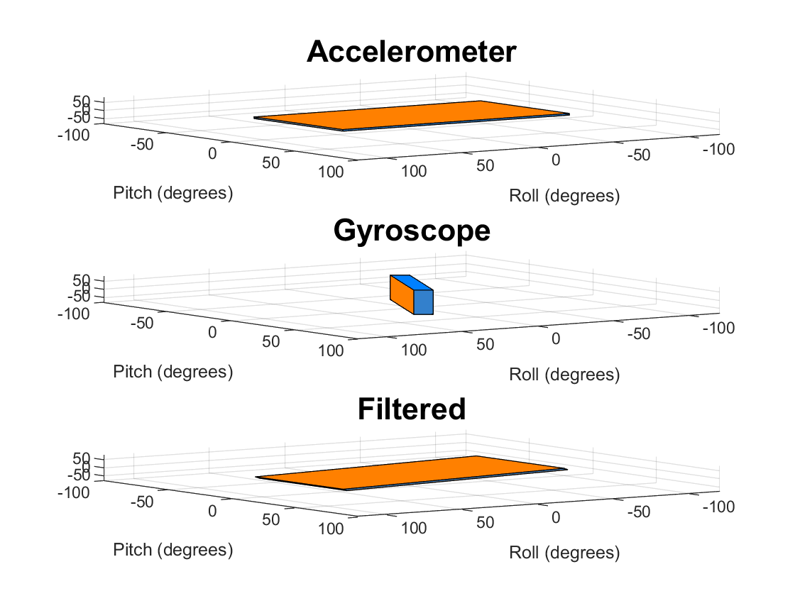

# Lab 4 Log

## Task 1 - The inertia Measurement Unit (IMU)

### Accelerometer

The following code was used to test the accelerometer

```matlab
clear all
clf
ports = serialportlist;
pb = PyBench(ports(end));

% parameters
fs = 50;
pb = pb.set_samp_freq(fs);
x_min = 0.7;
x_max = 1.2;
N = 150; % number of samples

% capture step response
pb.dc(x_min);               % initial bulb value
pause(1);                   % wait 1 sec to settle
pb.dc(x_max)                % rising step to bulb
rise = pb.get_block(N);     % capture N samples
pb.dc(x_min)                % falling step to bulb
fall = pb.get_block(N);     % capture another N samples
data = [rise' fall'];       % combine rise with fall

% plotting
figure(1)
clf
plot(data)
xlabel("Samples number");
ylabel("Output (V)");
title("Step Response - Experimental");
fclose(instrfind());        % close the port
```

On the horizontal axis (pitch) tilting away from me is positive, towards me is negative.

On the vertical axis (roll) tilting left is positive, right is negative.

When the PyBench is shaken, it creates lots of noise since the movement adds extra forces in addition to those due to gravity.

### Gyroscope

The following code was used to control the gyroscope

```matlab
% testing the gyroscope

clear all
close("all")
ports = serialportlist;
pb = PyBench(ports(end));
N = 500; % 500 time points
end_time = 10.0; % initial guess of time axis range
gx = 0; gy = 0; % initialise pitch and roll

while true
    % plot axes first for plot later
    figure(1)
    clf(1)
    axis([0 end_time -90 90]);
    title("Gyroscope Pitch & Roll Angles", "FontSize", 16);
    ylabel("Angles (deg)", "FontSize", 14);
    xlabel("Time (sec)", "FontSize",14);
    grid on; hold on;
    timestamp = 0;
    tic;

    % read gyroscope data
    for i = 1:N
        [x, y, z] = pb.get_gyro(); % angular rate in rad/s
        dt = toc; % get elapsed time
        tic;
        timestamp = timestamp + dt;
        gx = max(min(gx + x * dt, pi/2), -pi/2); % limit to +- pi/2
        gy = max(min(gy + y * dt, pi/2), -pi/2);
        plot(timestamp, gy * 180 / pi, ".b"); % plot pith in blue
        plot(timestamp, gx * 180 / pi, ".r"); % plot roll in red
        pause(0.001);
    end
    end_time = timestamp;
end
```

Major drift was observed when using the gyroscope, especially on the roll axis. However they still displayed accurate measurements when the PyBench was shaken.

## Task 2 - Visualization in 3D

The following code was used to reproduce the 3D visulatisation

```matlab
% 3d visualisation

clear all
close("all")
ports = serialportlist;
pb = PyBench(ports(end));
model = IMU_3D();
N = 50;
tic;
gx = 0; gy = 0;
fig1 = figure(1);
while true
    for i = 1:N
        [p, r] = pb.get_accel();
        [x, y, z] = pb.get_gyro();
        dt = toc;
        tic;
        pitch = p * 180 / pi;
        roll = r * 180 / pi;
        gx = max(min(gx + x * dt, pi/2), -pi/2);
        gy = max(min(gy + y * dt, pi/2), -pi/2);
        clf(fig1);
        subplot(2, 1, 1);
        model.draw(fig1, p, r, "Accelerometer");
        subplot(2, 1, 1);
        model.draw(fig1, gy, gx, "Gyroscope");
        pause(0.0001);
    end
end
```

When the PyBench is rotated on its x and y axis the 3d object rotates accordingly.

When the board is shaken the accelerometer  gets very noisy, but the gyroscope readings remain accurate. However the gyroscope model experiences drift.

## Task 3 - Combining the two measurements using Complementary Filter

The complementary filter was implemeted on the visualiser using following code

```matlab
% complementary filter
clear all
close("all")
ports = serialportlist;
pb = PyBench(ports(end));
model = IMU_3D;
N = 50;
fig1 = figure(1);
gx = 0; gy = 0;                     % gyro initial angles
angle_x = 0; angle_y = 0;           % combined angle using filter
alpha = 0.7; beta = 1-alpha;        % weighting factor
tic
while true
    for i = 1:N
        [p, r] = pb.get_accel();
        [x, y, z] = pb.get_gyro();
        dt = toc;
        tic;

        % integration for gyro angles
        gx = max(min(gx + x * dt, pi / 2), -pi / 2);
        gy = max(min(gy + y * dt, pi / 2), -pi / 2);

        % complementary filtered angles
        angle_x = alpha * (angle_x + x * dt) + beta * r;
        angle_y = alpha * (angle_y + y * dt) + beta * p;

        figure(fig1)
        clf(fig1);
        subplot(3, 1, 1);
        model.draw(fig1, p, r, "Accelerometer");
        subplot(3, 1, 2);
        model.draw(fig1, gy, gx, "Gyroscope");
        subplot(3, 1, 3);
        model.draw(fig1, angle_y, angle_x, "Filtered");
        pause(0.1);
    end
end
```



## Task 4 - Using the OLED driver on the PyBench Board

The following code was used

```python
"""

Lab 4 Task 4

OLED display driver

"""

import pyb                      # Pyboard lib
from pyb import LED, ADC, Pin   # Import classses from lib
from oled_938 import OLED_938   # Use OLED display driver

# Create peripheral objects
b_LED = LED(4)                  # blue LED
pot = ADC(Pin("X11"))           # 5k Ohm potentiometer to ADC input on pin X11

# I2C connceted to Y9, Y10 (I2C bus 2) and Y11 is reset low active
i2c = pyb.I2C(2, pyb.I2C.MASTER)
oled = OLED_938(
    pinout = {
        "sda": "Y10",
        "scl": "Y9",
        "res": "Y8"
    },
    height = 64,
    external_vcc = False,
    i2c_devid = i2c.scan()[0]
)
oled.poweron()
oled.init_display()

# Message
oled.draw_text(0, 0, "Hello World!") # each character is 6x8 pixels

tic = pyb.millis()              # store start time
while True:
    b_LED = pyb.toggle()
    toc = pyb.millis()          # read elapsed time
    oled.draw_text(0, 20, f"Delay Time: {(toc - tic) * 0.001}")
    oled.draw_text(0, 40, f"POT5K reading: {pot.read()}")
    tic = pyb.millis()          # start time
    oled.display()
    delay = pyb.rng()%1000      # make rng between 0 & 999
    pyb.delay(delay)            # delay in milliseconds  
```

In order to make the text appear in the centre of the screen, the position during the following function must be changed.

```python
oled.draw_text(0, 0, "Hello World!")
```

This is currently `0, 0` (top left corner). If this is changed to the following code it appears in the centre of the screen.

```python
oled.draw_text(64, 32, "Hello World!")
```
