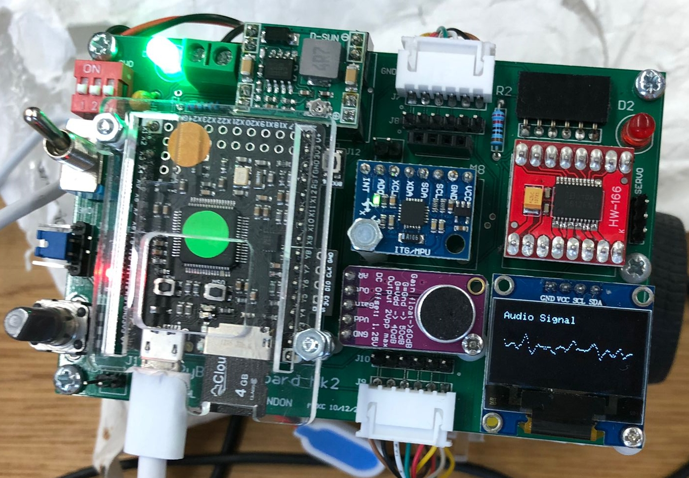

# Lab 6 - Beat Detection

## Task 1 - Moving Average Frequency

The moving average filter was tested in MATLAB with the following code

```matlab
clear all
[sig fs] = audioread("bgs.wav");

% add noise to music
x = sig + 0.2 * rand(size(sig));

% plot the signal
figure(1);
clf;
plot(x);
xlabel("Sample no");
ylabel("Signal (v)");
title("Stay Alive music");

% filter music with moving average filter
N = size(x);
for i = 4 : N
    y(i) = (x(i) + x(i-1) + x(i-2) + x(i-3))/4;
end

y(1) = x(1) / 4;
y(2) = (x(2) + x(1) / 4);
y(3) = (x(3) + x(2) + x(1))/4;

% play original & then the filtered sound

sound(x, fs)
disp("playing the original - press enter when done")
pause;
sound(y, fs)
disp("playing the filter music")
```

When the original version (with noise added) was played back-to-back with the version with the moving average filter applied, a noticeable reduction to high pitched noise was heard.

The code was amended so that you can easily change the number of taps. The following code snippet was added

```matlab
N = size(x);
N_tap = 20
for i=N_tap:N
    temp = 0;
    for j = 0:N_tap-1
        temp = temp + x(i-j);
    end
    y(i) = temp/N_tap;
end
```

## Task 2 - Exploring MICROPHONE Class

The MICROPHONE class was downloaded and read by my lab partner and I. It uses interrupts to fill a sample buffer and compute the instantaneous energy `E` from that.

The MICROPHONE class was tested using `lab6task2b.py` (from course website), the PyBench OLED displayed an autoreactive waveform as expected.



## Task 3 - Basic Beat Detection

The basic beat detection code was downloded from the coruse website

```python
import pyb
from pyb import Pin, Timer, ADC, DAC, LED
from array import array			# need this for memory allocation to buffers
from oled_938 import OLED_938	# Use OLED display driver
from audio import MICROPHONE

#  The following two lines are needed by micropython
#   ... must include if you use interrupt in your program
import micropython
micropython.alloc_emergency_exception_buf(100)

# I2C connected to Y9, Y10 (I2C bus 2) and Y11 is reset low active
i2c = pyb.I2C(2, pyb.I2C.MASTER)
devid = i2c.scan()				# find the I2C device number
oled = OLED_938(
    pinout={"sda": "Y10", "scl": "Y9", "res": "Y8"},
    height=64,
    external_vcc=False,
    i2c_devid=i2c.scan()[0],
)
oled.poweron()
oled.init_display()
oled.draw_text(0,0, 'Beat Detection')
oled.display()

# define ports for microphone, LEDs and trigger out (X5)

b_LED = LED(4)		# flash for beats on blue LED

def flash():		# routine to flash blue LED when beat detected
	b_LED.on()
	pyb.delay(10)
	b_LED.off()

# Create timer interrupt - one every 1/8000 sec or 125 usec
pyb.disable_irq()
sample_timer = pyb.Timer(7, freq=8000)	# set timer 7 for 8kHz

N = 160				# number of sample to calculate instant energy
mic = ADC(Pin('Y11'))
audio = MICROPHONE(sample_timer, mic, N)
pyb.enable_irq(True)
oled.draw_text(0,20, 'Ready to GO')	# Useful to show what's happening?
oled.display()
pyb.delay(100)

# Calculate energy over 50 epochs, each 20ms (i.e. 1 sec)
M = 50						# number of instantaneous energy epochs to sum
BEAT_THRESHOLD = 2.0		# threshold for c to indicate a beat
MIN_BEAT_PERIOD = 500	# no beat less than this

# initialise variables for main program loop
e_ptr = 0					# pointer to energy buffer
e_buf = array('L', 0 for i in range(M))	# reserve storage for energy buffer
sum_energy = 0				# total energy in last 50 epochs

tic = pyb.millis()			# mark time now in msec

while True:				# Main program loop
	if audio.buffer_is_filled():		# semaphore signal from ISR - set if buffer is full
		
		# Fetch instantaneous energy
		E = audio.inst_energy()			# fetch instantenous energy
		audio.reset_buffer()			# get ready for next epoch

		# compute moving sum of last 50 energy epochs with circular buffer
		sum_energy = sum_energy - e_buf[e_ptr] + E
		e_buf[e_ptr] = E			# over-write earliest energy with most recent
		e_ptr = (e_ptr + 1) % M		# increment e_ptr with wraparound - 0 to M-1
		average_energy = sum_energy/M

		# Compute ratio of instantaneous energy/average energy
		c = E/average_energy
		
		if (pyb.millis()-tic > MIN_BEAT_PERIOD):	# if longer than minimum period
			if (c>BEAT_THRESHOLD):		# look for a beat
				flash()					# beat found, flash blue LED
				tic = pyb.millis()		# reset tic
		audio.rest_buffer()				# reset status flag
```

When tested with staying alive the LED blinked roughly in time with the beat.